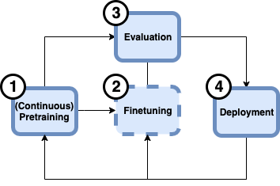

# AWSome FMOps

This repository contains reference architectures and test cases for Foundation Model Operations (FMOps) on [Amazon EKS](https://aws.amazon.com/eks). 

Foundation Model Operations (FMOps) encompass the end-to-end processes involved in managing foundation models, from initial pretraining to deployment and monitoring. This repository is designed to showcase the usage of different frameworks at each stage of the foundation model lifecycle and the end-to-end pipeline. Specifically, FMOps in this repository involve the following four stages: continuous pretraining, finetuning, evaluation, and deployment. The following section, "Stages of Foundation Model Operations," elaborates on each stage. Each subdirectory of this repository ([pretraining](./pretraining), [finetuning](./finetuning), [evaluation](./evaluation), [deployment](./deployment)) includes test cases for each stage.

Our infrastructure is deployed using [Terraform](https://www.terraform.io/). Please refer to the [deployment guide](./infra/README.md) for the infrastructure setup guide.

### Stages of Foundation Model Operations

Foundation Model Operations (FMOps) encompass the processes and practices involved in (continuous) pretraining, fine-tuning, evaluating, and deploying foundation models. 

__1. (Continuous) Pretraining__ is the initial stage where the foundation model is trained on a broad and diverse dataset to learn general knowledge. This stage involves using large-scale data to develop a model that can generalize across various tasks and domains. The pretraining process is often continuous, meaning the model is periodically updated with new data to improve its performance.

__2. Finetuning__  involves adapting the pretrained foundation model to specific tasks or domains. This optional stage can be divided into two sub-stages:
* __Instruction tuning__: This process involves refining the model's ability to follow specific instructions or prompts, enhancing its performance on particular tasks by providing additional task-specific data and instructions.
* __Alignment__: This sub-stage ensures that the model's outputs align with desired behaviors and ethical guidelines. It involves adjusting the model to reduce biases, improve safety, and ensure that it meets the specific requirements of the application domain.

__3. Evaluation__  is a critical stage that occurs after both pretraining and finetuning. It involves assessing the model's performance using standardized benchmarks and metrics. Evaluation helps track the model's progress, identify areas for improvement, and ensure that the model meets the desired performance criteria. 

__4. Deployment__  is the final stage, where the foundation model is integrated into production environments. This stage includes:
* __Serving__: Making the model available for use in real-world applications, ensuring it can handle the required load and provide timely responses.
* __Monitoring__: Continuously tracking the model's performance and behavior in production to detect and address any issues, such as performance degradation or unexpected outputs. Monitoring also involves updating the model as needed to maintain its effectiveness and relevance.

By following these stages, organizations can effectively develop, fine-tune, evaluate, and deploy foundation models, ensuring they deliver high performance and align with the intended use cases and ethical standards.

## License

This library is licensed under the MIT-0 License. See the LICENSE file.

